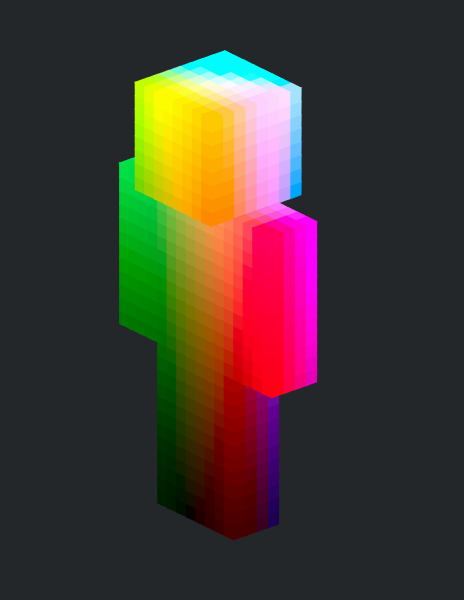
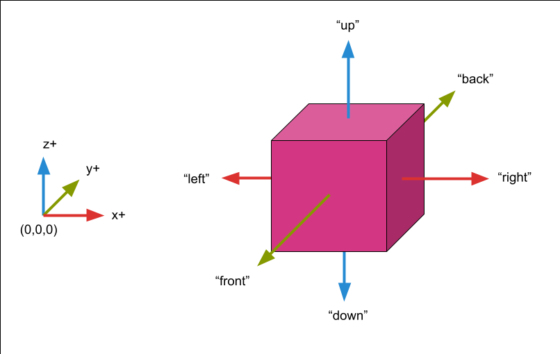
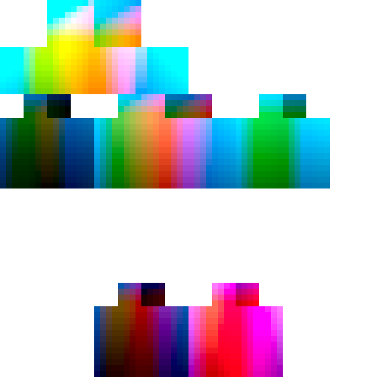

# mc-skin



A Python modeler/editor library for Minecraft skins. Knows how to translate a
2D skin image to a 3D space and vice versa. Once in 3D, you can color the skin by
indexing on a voxel's `x`, `y`, `z`, and `face` coordinates.

## Getting Started

The main flow you will use is:

```python
from mc_skin import Skin

skin = Skin.new()

for (x, y, z), body_part_id, face_id, color in skin.enumerate_color():
    # see explanations below for what these variables mean

    # color is a view into the skin's color data. you can get or set it
    print(color)

    # set to magenta at full transparency (RGBA). Note the [:] syntax
    color[:] = [211, 54, 130, 255]

    # will print updated value
    print(color)

skin.get_pil_image().save("my_skin.png")
```

## Coordinate system

mc-skin uses a coordinate system with the origin at the left-down-front of the
skin **from the perspective of an observer looking at the skin**.



## `FaceId`

In some methods, a `FaceId` type is asked for or provided. These are string literals:

- `up`
- `down`
- `left`
- `right`
- `front`
- `back`

## `BodyPartId`

Similarly, body parts are string literals under `BodyPartId`:

- `head`
- `torso`
- `right_arm`
- `left_arm`
- `right_leg`
- `left_leg`

Body parts are also labeled this way. For example, `left_arm` is the arm on the
left from the observer's perspective.

## Example

In the main image above, we mapped the LAB color space to the model's
coordinate space. It was generated with the following code:

```python
import numpy as np
import skimage.color

from mc_skin import Skin

def generate_lab_space():
    """
    Map the LAB color spaces onto a skin. The components for L, A, and B come
    from the z, x, and y dimensions of each voxel, respectively.
    """
    skin = Skin.new()

    x_max, y_max, z_max = skin.shape[:3]

    l_space = np.linspace(0, 100, z_max)
    a_space = np.linspace(-128, 127, x_max)
    b_space = np.linspace(127, -128, y_max)

    for (x, y, z), _, _, color in skin.enumerate_color():
        lab = [l_space[z], a_space[x], b_space[y]]

        rgb = skimage.color.lab2rgb([lab]) * 255  # type: ignore
        color[:3] = rgb
        color[3] = 255

    # save the usable skin
    skin.get_pil_image().save("lab_space.png")
```



You can grab this skin for use (and others) by looking in
[examples/skins](examples/skins).
